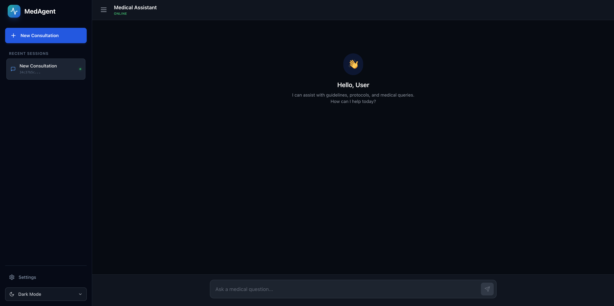
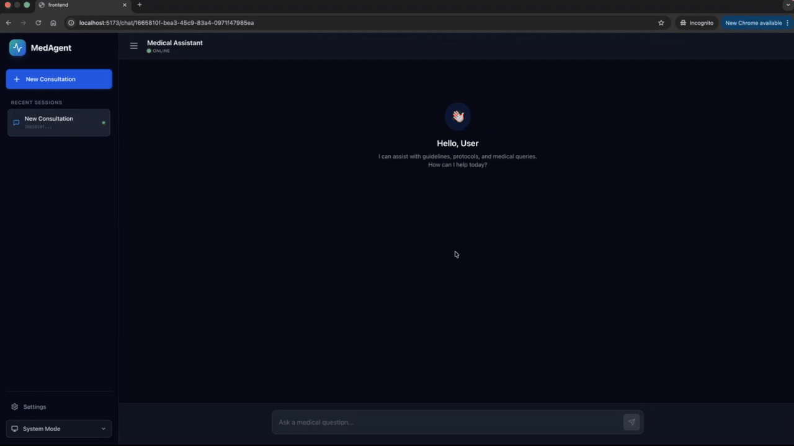
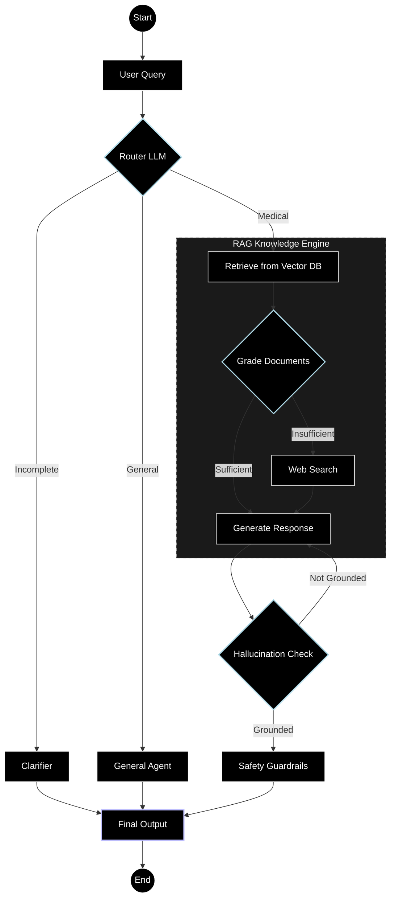

# Medical Knowledge Agent (MedAgent)



A production-ready AI agent that automates medical query handling, providing well-researched answers using Retrieval-Augmented Generation (RAG) with LLM-driven control flow. Built with LangChain, LangGraph, FastAPI (backend), and React (frontend).

This project demonstrates an intelligent medical assistant that classifies user intents, retrieves relevant knowledge from a vector DB or web, checks for hallucinations, and applies safety guardrails, all orchestrated by an LLM.

## Demo


Original demo video: `assets/MedAgent-Demo.mp4`

## Features

- **LLM-Driven Workflow**: Uses an LLM router to classify queries (medical, general, and incomplete) and control the agent's flow.
- **RAG Pipeline**: Hybrid retrieval (via Chroma + BM25) with web fallback (Tavily Search API).
- **Clarification & Safety**: Asks for details on vague queries; adds disclaimers and blocks unsafe content (e.g., no diagnoses).
- **Hallucination Detection**: LLM-based grader to ensure responses are grounded in retrieved context.
- **Semantic Caching**: Volatile cache with FAISS for faster repeated queries.
- **State Management**: LangGraph with Redis checkpointing for conversational state.
- **Frontend UI**: React app with chat interface, session management, dark mode, and responsive design.
- **Backend API**: FastAPI endpoints for chat, history, and sessions.
- **Databases**: SQLite for chat history, Chroma for vector store, Redis for agent checkpointing.
- **Configurable LLMs/Embeddings**: Supports Ollama, OpenAI and Vertex AI.
- **Logging & Monitoring**: Structured logging (console and file); optional LangSmith tracing.
- **Server Side Events**: Events directly streamed to frontend using SSE after each step done by agent.

## How It Works: Agentic Workflow

This section explains the core "ideas" of the project. Unlike traditional linear pipelines, the application uses **LangGraph** to create a cyclic state machine, allowing the agent to reason, backtrack, and validate its own information before responding.

MedAgent uses an agent state graph with conditional edges to manage the complexity of medical inquiries. This ensures that every response is grounded in facts and filtered through safety guardrails.

### 1. The Intent Router

The journey begins at the **Router**. Instead of using simple keyword matching, we employ a high-reasoning LLM to analyze the user's "state."

- **Medical Path:** Triggered when the query contains health concerns, symptoms, or drug information.
- **General Path:** Handles greetings or meta-questions about the bot itself.
- **Incomplete Path:** If the user provides incomplete information (e.g., "I feel pain"), the router directs to a **Clarifier node** to ask for location, severity, and duration.

### 2. The RAG Knowledge Engine

Once a medical intent is confirmed, the graph enters the Knowledge Engine subgraph:

- **Hybrid Retrieval:** The system queries a Chroma vector database using semantic search and a BM25 index for keyword precision.
- **The Grader Node:** This is a critical safety step. An LLM acts as a "quality controller," grading retrieved documents for relevance. If the internal knowledge is outdated or insufficient, the graph dynamically triggers a **Tavily Web Search** fallback.

### 3. Self-Reflection & Hallucination Grading

Before the response reaches the user, the graph performs two "self-reflection" loops:

- **Groundedness Check:** The LLM compares its generated answer against the retrieved documents. If the answer contains "hallucinated" facts not present in the source, the node sends the state back to the Generator for a second pass.
- **Safety Guardrail:** Every final output is passed through a medical safety filter. It ensures the tone is professional and automatically appends a mandatory medical disclaimer while stripping away any definitive diagnostic language.

### 4. Persistence & State

Because we use **Redis Checkpointing**, the graph remembers the state of the conversation. If the user provides a clarification three messages later, LangGraph resumes the medical flow with the context of the entire session history.

## Architecture

The agent uses LangGraph for the workflow and Server-Sent Events (SSE) to stream real-time updates to the UI:

1. **Router**: LLM classifies query intent.
2. **Branches**:
   - Incomplete → Clarifier (asks for more info).
   - General → Handles greetings/small talk.
   - Medical → Retrieve → Grade → (Web Search if needed) → Generate → Hallucination Check → Guardrail (with loopback on hallucination failure).
3. **Output**: Streams "thinking steps" (e.g., Retrieving..., Grading...) followed by the final response. Responds with disclaimer if needed.

### Architecture Diagram



## Tech Stack

| Layer             | Technology                                    |
| :---------------- | :-------------------------------------------- |
| **Orchestration** | LangGraph, LangChain                          |
| **LLM Providers** | Vertex AI, Ollama, OpenAI                     |
| **Vector DB**     | ChromaDB, FAISS (Cache)                       |
| **Database**      | SQLite (History), Redis (State/Checkpointing) |
| **Frontend**      | React, Tailwind CSS, Vite                     |
| **Backend API**   | FastAPI, Pydantic                             |

## Prerequisites

- Python 3.13+
- Node.js 22+
- Redis (for checkpointing)
- API keys for Tavily (web search)
- LLM Providers (provide any) - Vertex AI, Ollama, OpenAI
- Optional: API keys for LangSmith

## Installation

1. Clone the repo

2. **Backend Setup**:

   ```
   cd backend
   python -m venv venv
   source venv/bin/activate  # On Windows: venv\Scripts\activate
   pip install -r requirements.txt
   ```

3. **Frontend Setup**:

   ```
   cd frontend
   npm install
   ```

4. Configure `.env` (copy from `.env.example`):
   ```
    WEBSITE_HOST=<REACT WEBSITE>
    TEST=<BOOLEAN>
    REDIS_HOST=<REDIS HOST>
    REDIS_PORT=<REDIS PORT>
    TAVILY_API_KEY=<SECRET KEY>
    GOOGLE_APPLICATION_CREDENTIALS=<CREDENTIAL PATH>
    VERTEX_PROJECT_ID=<PROJECT ID>
    LLM_PROVIDER=<"vertex"|"openai"|"ollama">
    LLM_MODEL=<MODEL NAME>
    EMBEDDING_MODEL=<EMBEDDING MODEL NAME>
   # Add others as needed (e.g., OPENAI_API_KEY, LANGSMITH_API_KEY, LANGSMITH_TRACING, LANGSMITH_ENDPOINT)
   ```

## Running the Application

1. **Start Redis** (if not running):

   ```
   redis-server
   ```

2. **Run Backend**:

   ```
   cd backend
   python3 main.py
   ```

3. **Run Frontend**:

   ```
   cd frontend
   npm run dev
   ```

   Open http://localhost:5173. The app will redirect to a new chat session.

## Usage

- **Chat Interface**: Ask medical questions (e.g., "What are symptoms of flu?"). The agent clarifies if needed.
- **Sessions**: Create new sessions via sidebar; view history.
- **Theme**: Toggle light/dark/system mode.
- **API Endpoints**:
  - POST `/chat`: Send query (body: {query, session_id}).
  - GET `/history/{session_id}`: Get chat history.
  - GET `/session`: Create new session.
  - GET `/sessions`: List sessions.
  - DELETE `/session/{session_id}`: Delete a chat session

## Assumptions

- For now MedAgent only uses three LLM providers: Vertex AI, Ollama, and OpenAI.
- LLMs have a hard timeout of 1 minute and maximum 3 retries on failure.
- Only top 3 searches are indexed from web search.
- Prerequisites are external sources which are necessary to use/deploy MedAgent.
- Results generated by the agent is dependant on the interworkings of the prompt.

## License

MIT License. See [LICENSE](LICENSE) for details.

## Acknowledgments

- Built with [LangChain](https://langchain.com), [FastAPI](https://fastapi.tiangolo.com), [React](https://reactjs.org).
- Inspired by real-world AI agents for healthcare.
